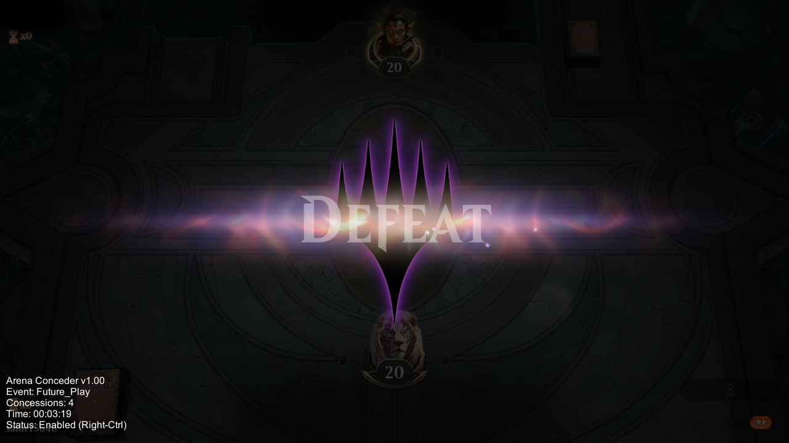

# Arena Conceder

A tool to auto-concede matches in MTG Arena.

Currently only supports the Non-Ranked Standard 2020 event.

## Why

With this season coming to an end soon and many users having to grind extra hours to get the most out of their investment, Arena Conceder offers the community a way to help those in need reach their goal faster. If you don't mind conceding games in a non-ranked event then please consider running this when you aren't playing to help everyone else out.

## How

Arena Conceder is a modified version of [Animadoria's UnityGameHook](https://github.com/Animadoria/UnityGameHook). It injects itself into the game, creates a persistent GameObject that then manipulates Arena to perpetually queue and concede. This means that it can run in the background while you play other games.

## Usage

Grab the [latest release](https://github.com/Dnawrkshp/arena-conceder/releases) and unpack it into a directory. After unpacking it, open the file called `ArenaConcederSettings.xml` with your favorite text editor. Find the entry surrounded by the `GameDirectory` tags and make sure that the path points to your MTGA installation. If it doesn't, find your MTGA installation by finding the `MTGA.exe` file and then place the path to that file's directory in between the `GameDirectory` tags. And that's it! Just launch `ArenaConceder.exe`, let it install and then launch MTG Arena for you. It will automatically clean up the modded assemblies so that the next time you launch Arena you won't start conceding games.

 **IMPORTANT: The tool cannot select a deck automatically so on first launch it will send you to the deck selection menu and you will have to manually submit a valid deck. After that, for the duration of the process, it will reuse that deck.**

## Compiling

If you wish to build this yourself then you will need the following:

* Visual Studio 2017
* .NET Framework 4.0
* MTG Arena

You will also need to make sure that the `Assembly-ScriptHook` project has properly referenced its Arena library dependencies. If you have the same installation path as I do then it should load just fine but if it doesn't then you will need to update the references manually. All the appropriate libraries are located in the `MTGA_ROOT/MTGA_Data/Managed` directory.

## Credits

* [UnityGameHook](https://github.com/Animadoria/UnityGameHook)
* [Mono.Cecil](https://github.com/jbevain/cecil)

## License

[MIT License](LICENSE)
